# Resultados dos Testes

Foram executados testes funcionais na API Restful Booker com foco em:

- Autenticação
- CRUD de reservas
- Validações
- Tratamento de erros
- Filtros de busca

---

# Evidências dos Testes

---

# CT001 - Health Check

## Resultado

**PASSOU**

## Evidência

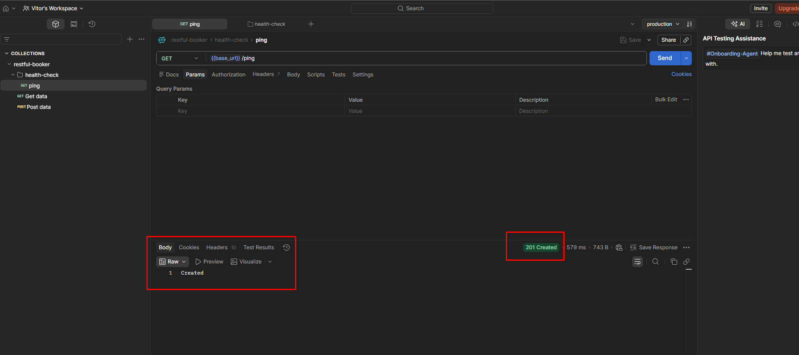

## Observação

Ping criado com sucesso

---

# CT002 - Login válido

## Resultado

**PASSOU**

## Evidência

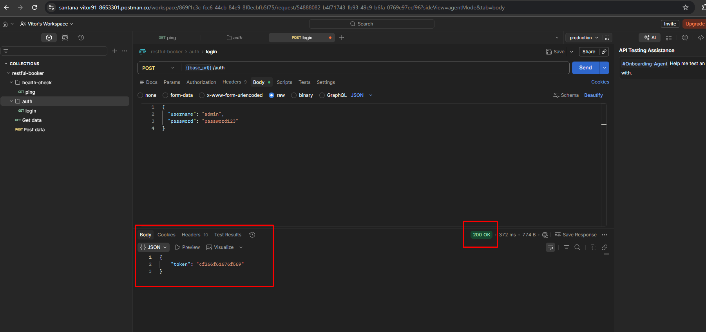

## Observação

Auth criado com sucesso

---

# CT003 - Login inválido

## Resultado

**PASSOU**

## Evidência

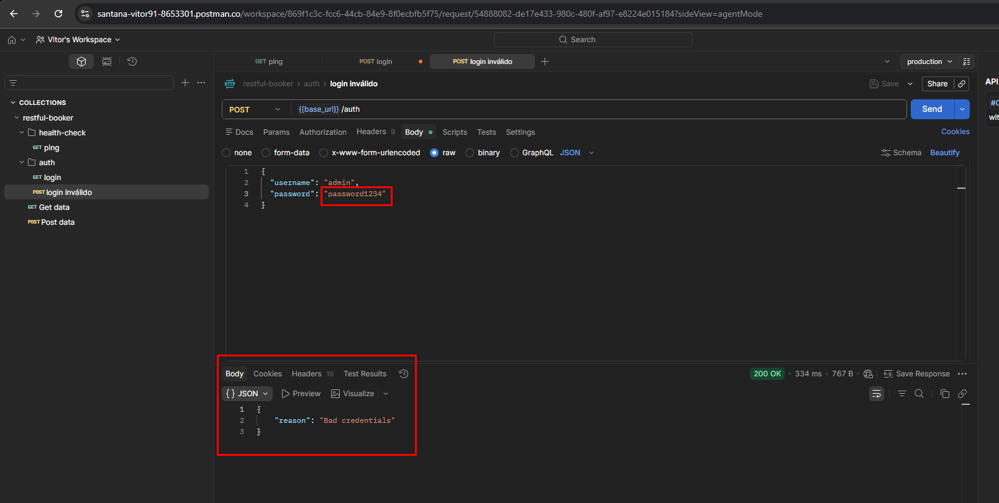

## Observação

Erro ao realizar login

---

# CT004 - Criar reserva válida

## Resultado

**PASSOU**

## Evidência

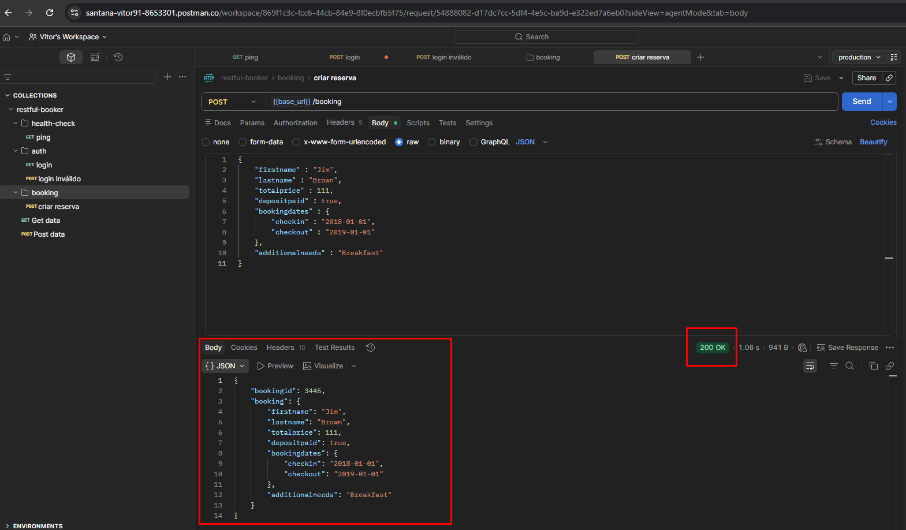

## Observação

Reserva criada com sucesso

---

# CT005 - Criar reserva sem firstname

## Resultado

**FALHOU**

## Evidência

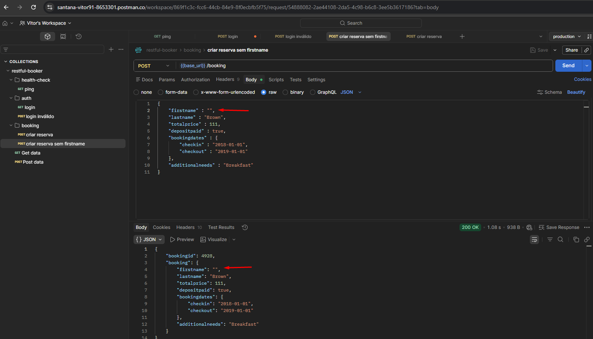

## Observação

A API aceitou criação mesmo sem campo obrigatório.

---

# CT006 - Criar reserva sem lastname

## Resultado

**FALHOU**

## Evidência

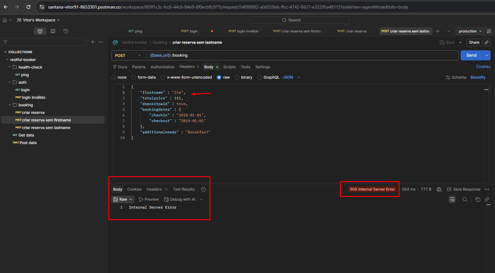

## Observação

Campo obrigatório não validado corretamente.

---

# CT007 - Criar reserva sem bookingdates

## Resultado

**PASSOU**

## Evidência

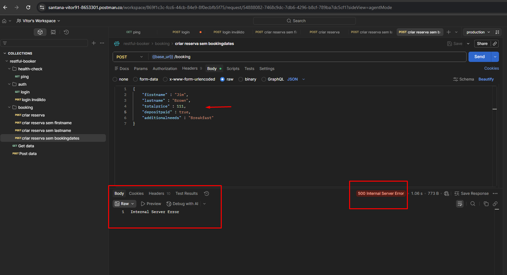

## Observação

Erro retornado corretamente.

---

# CT008 - Buscar reserva existente

## Resultado

**PASSOU**

## Evidência

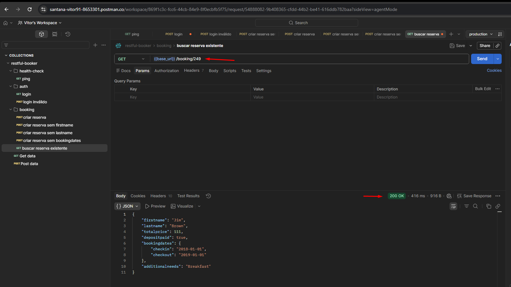

## Observação

Dados corretos retornados

---

# CT009 - Buscar reserva inexistente

## Resultado

**PASSOU**

## Evidência

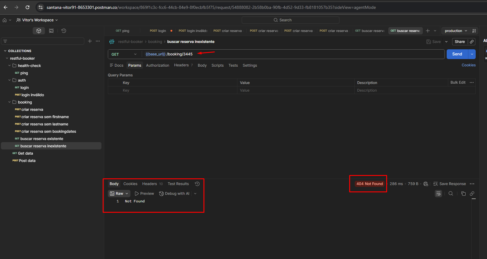

## Observação

Dados não encontrados

---

# CT010 - Atualizar reserva com token válido

## Resultado

**PASSOU**

## Evidência

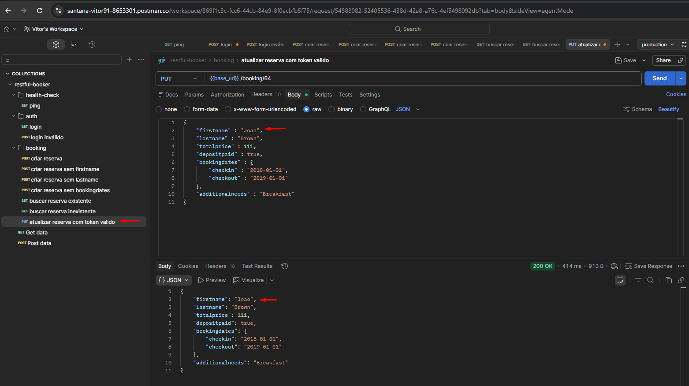

## Observação

Dados atualizados

---

# CT011 - Atualizar reserva sem token

## Resultado

**PASSOU**

## Evidência

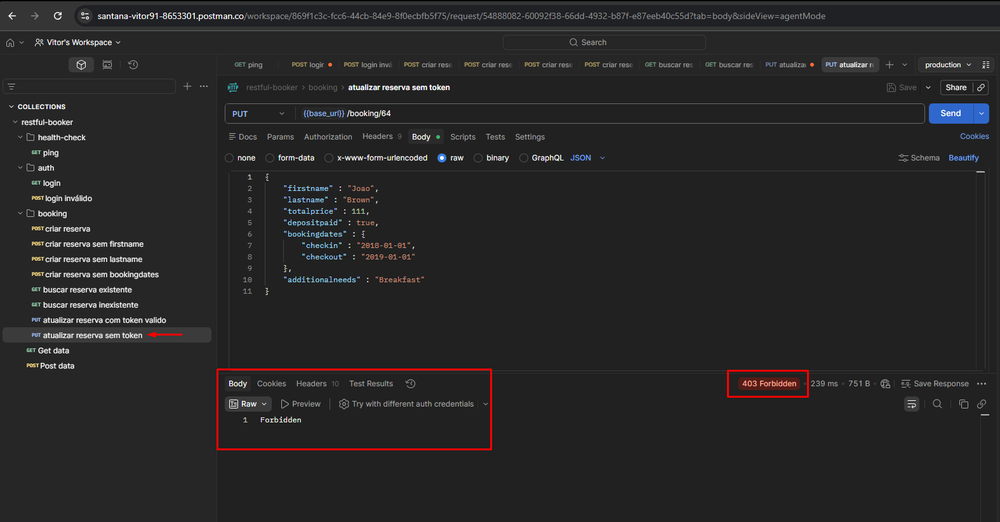

## Observação

Acesso negado

---

# CT012 - Atualização parcial da reserva

## Resultado

**PASSOU**

## Evidência

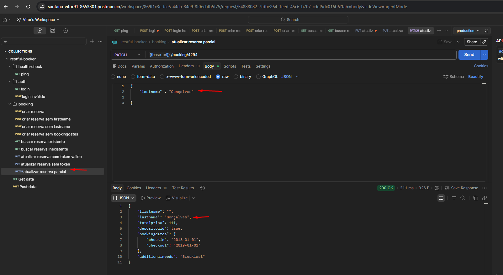

## Observação

Apenas campos enviados devem ser alterados

---

# CT013 - Deletar reserva com token válido

## Resultado

**PASSOU**

## Evidência

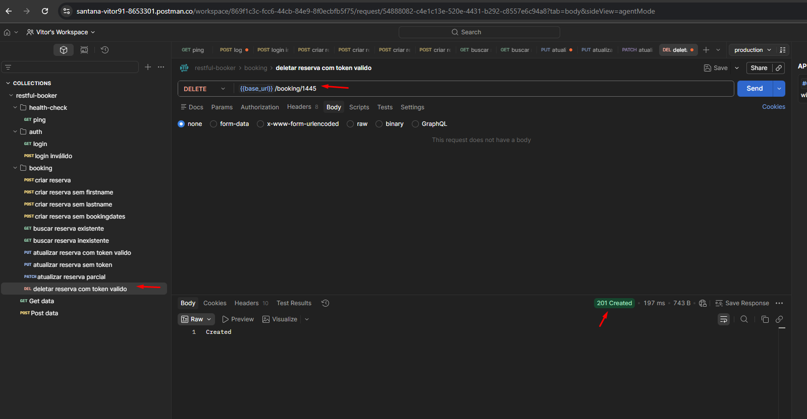

## Observação

Reserva deletada

---

# CT014 - Deletar reserva sem autenticação

## Resultado

**PASSOU**

## Evidência

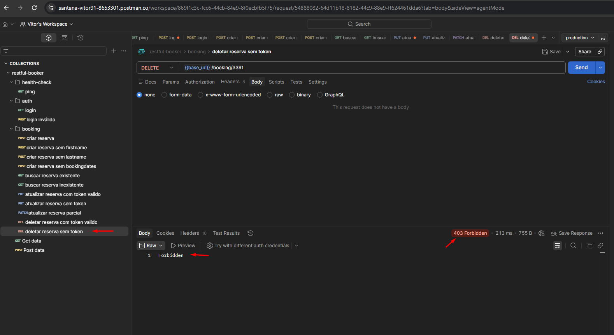

## Observação

Reserva não deletada, acesso negado

---

# CT015 - Buscar reservas por firstname

## Resultado

**PASSOU**

## Evidência

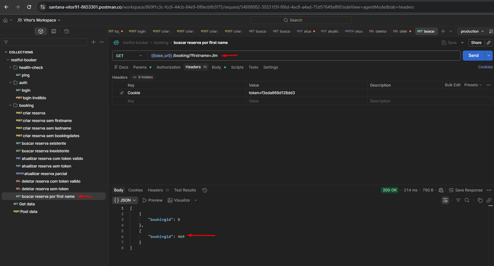

## Observação

Reserva encontrada pelo first name

---

# CT016 - Buscar reservas por período

## Resultado

**PASSOU**

## Evidência

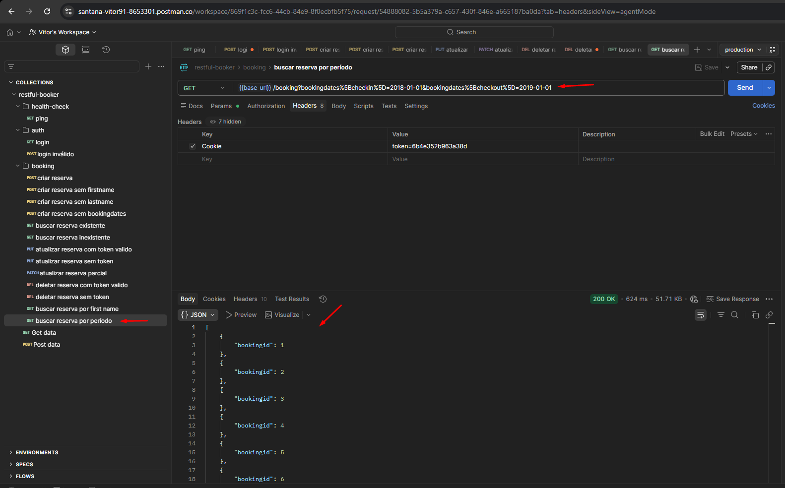

## Observação

Reserva encontrada por período

---

# CT017 - Enviar body inválido

## Resultado

**PASSOU**

## Evidência

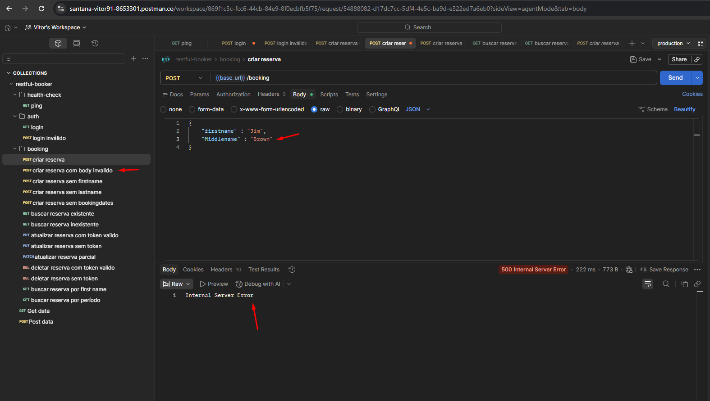

## Observação

Body inválido

---

# CT018 - Validar tipo incorreto de dados

## Resultado

**PASSOU**

## Evidência

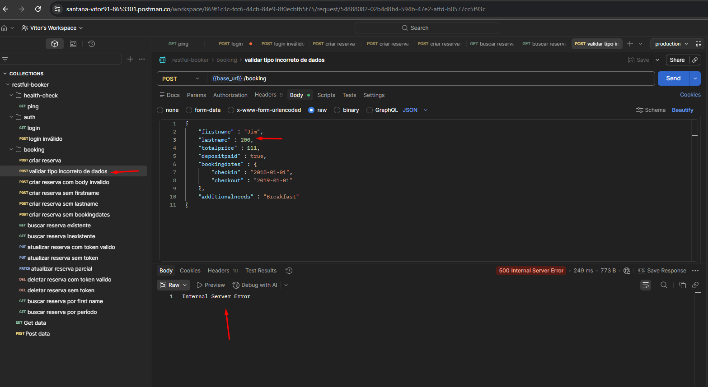

## Observação

API deve rejeitar request

# Conclusão

A API apresentou bom funcionamento nos fluxos principais de autenticação e CRUD.

Entretanto, foram identificadas falhas importantes nas validações de campos obrigatórios, permitindo criação de reservas incompletas.