# Casos de Teste - SauceDemo

# CT-001 - Login com usuário padrão

## Objetivo
Validar login com usuário válido.

## Passos
1. Acessar a aplicação
2. Inserir:
   - Username: standard_user
   - Password: secret_sauce
3. Clicar em Login

## Resultado Esperado
Usuário deve acessar a página de produtos.

## Resultado Obtido
Login realizado com sucesso.

## Evidências

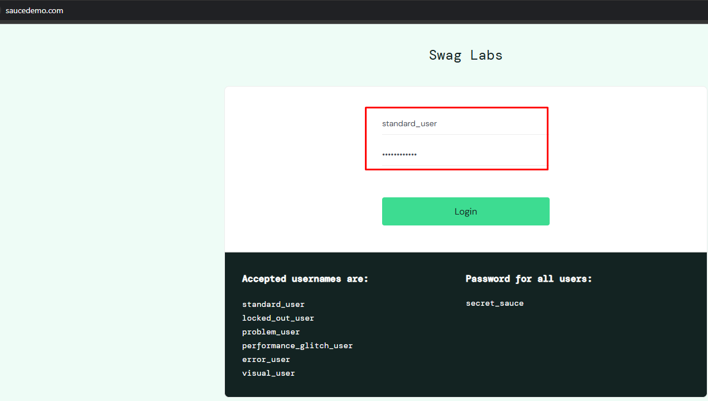

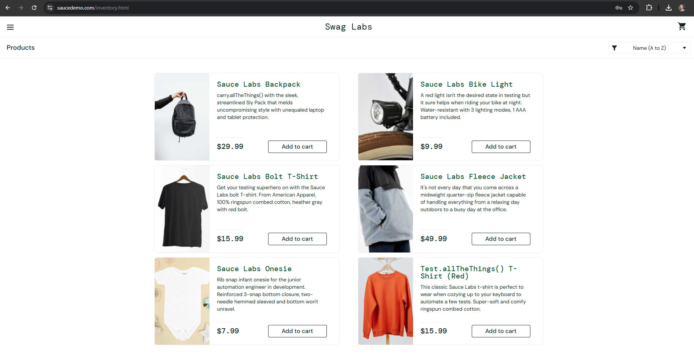

## Status
PASS

---

# CT-002 - Login com usuário bloqueado

## Passos
1. Inserir:
   - Username: locked_out_user
   - Password: secret_sauce
2. Clicar em Login

## Resultado Esperado
Sistema deve impedir acesso e exibir mensagem de erro.

## Resultado Obtido
Mensagem exibida corretamente.

## Evidências

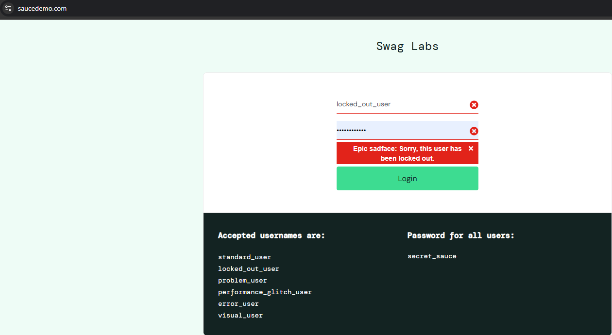

## Status
PASS

---

# CT-003 - Login com usuário problem_user

## Passos
1. Realizar login com problem_user
2. Navegar pela lista de produtos

## Resultado Esperado
Aplicação deve manter comportamento consistente.

## Resultado Obtido
Foram observadas inconsistências visuais em imagens.

## Evidências

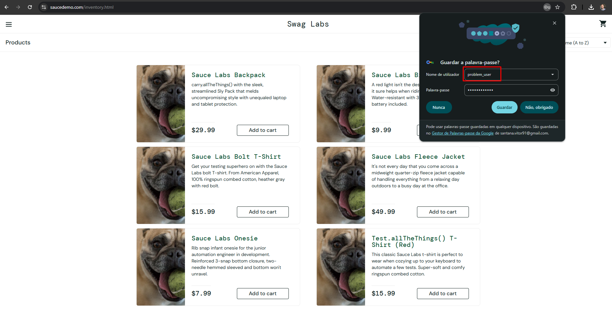

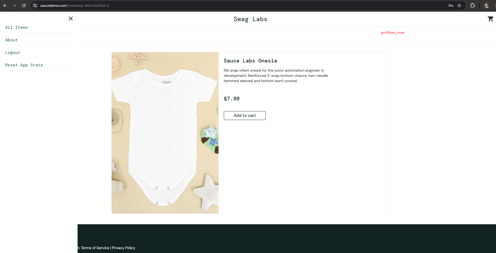

## Status
FAIL

---

# CT-004 - Login com usuário performance_glitch_user

## Passos
1. Realizar login com performance_glitch_user

## Resultado Esperado
Login realizado normalmente.

## Resultado Obtido
Login concluído com lentidão perceptível.

## Evidências

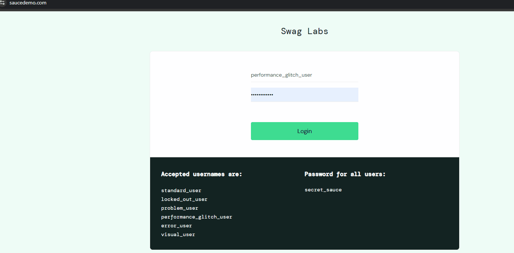

## Status
PASS COM OBSERVAÇÃO

---

# CT-005 - Ordenação de produtos por menor preço

## Passos
1. Acessar página de produtos
2. Selecionar filtro "Price (low to high)"

## Resultado Esperado
Produtos devem ser ordenados do menor para o maior preço.

## Resultado Obtido
Ordenação correta.

## Evidências

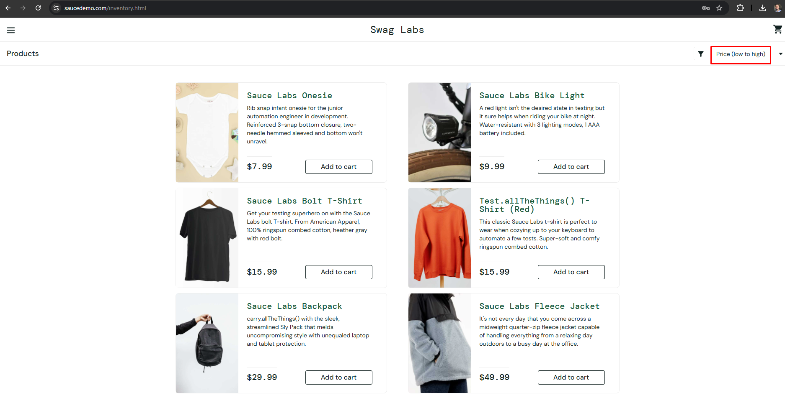

## Status
PASS

---

# CT-006 - Ordenação de produtos por nome

## Passos
1. Selecionar filtro "Name (A to Z)"

## Resultado Esperado
Produtos ordenados alfabeticamente.

## Resultado Obtido
Ordenação correta.

## Evidências

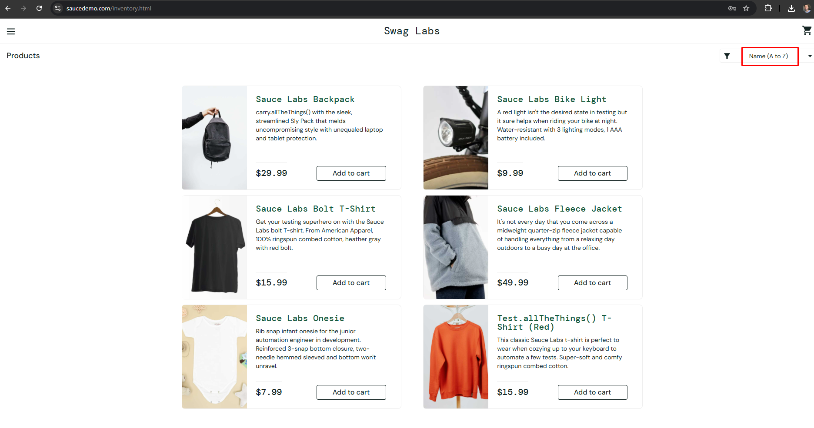

## Status
PASS

---

# CT-007 - Adicionar item ao carrinho

## Passos
1. Selecionar um produto
2. Clicar em "Add to cart"

## Resultado Esperado
Produto deve ser adicionado ao carrinho.

## Resultado Obtido
Produto adicionado corretamente.

## Evidências

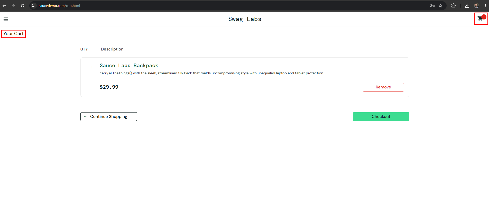

## Status
PASS

---

# CT-008 - Remover item do carrinho

## Passos
1. Adicionar produto
2. Remover produto do carrinho

## Resultado Esperado
Produto deve ser removido.

## Resultado Obtido
Produto removido corretamente.

## Evidências

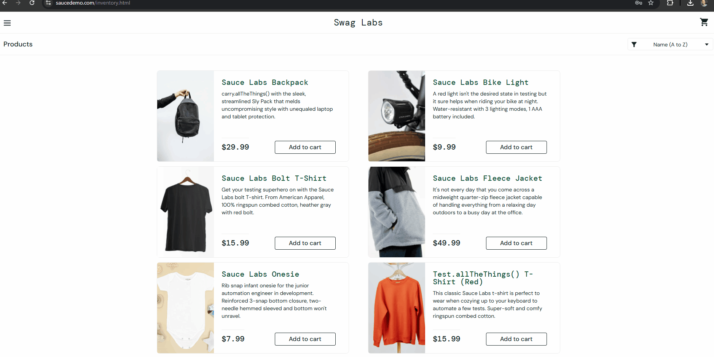

## Status
PASS

---

# CT-009 - Fluxo completo de compra

## Passos
1. Fazer login
2. Adicionar produto ao carrinho
3. Acessar checkout
4. Preencher:
   - Nome
   - Sobrenome
   - CEP
5. Finalizar compra

## Resultado Esperado
Mensagem de sucesso deve ser exibida.

## Resultado Obtido
Compra finalizada corretamente.

## Evidências

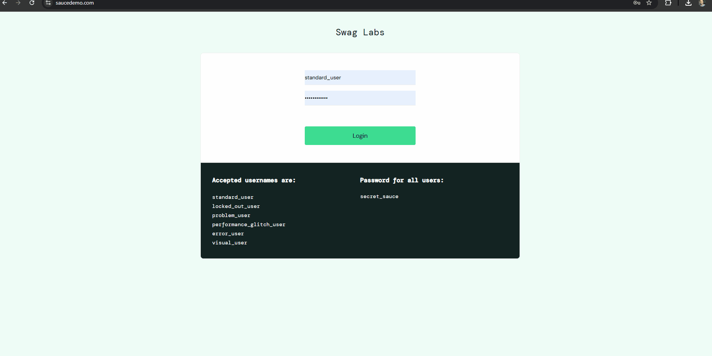

## Status
PASS

---

# CT-010 - Navegação entre páginas

## Passos
1. Navegar entre:
   - Produtos
   - Carrinho
   - Checkout

## Resultado Esperado
Todas as páginas devem carregar corretamente.

## Resultado Obtido
Navegação funcionando corretamente.

## Evidências

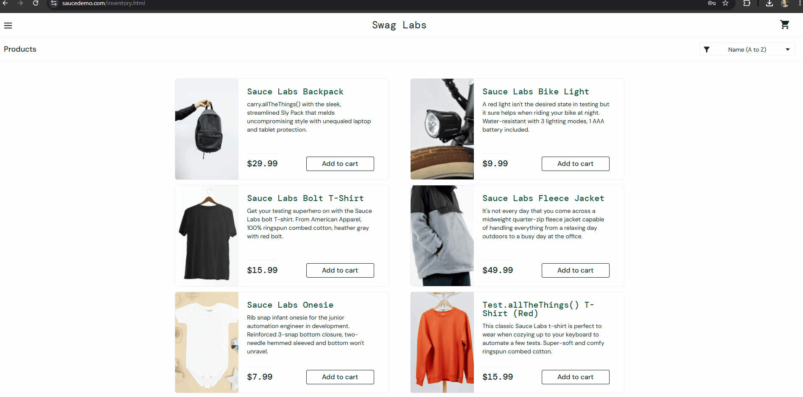

## Status
PASS

---

# CT-011 - Logout

## Passos
1. Fazer login
2. Abrir menu lateral
3. Clicar em Logout

## Resultado Esperado
Usuário deve retornar para tela de login.

## Resultado Obtido
Logout realizado corretamente.

## Evidências

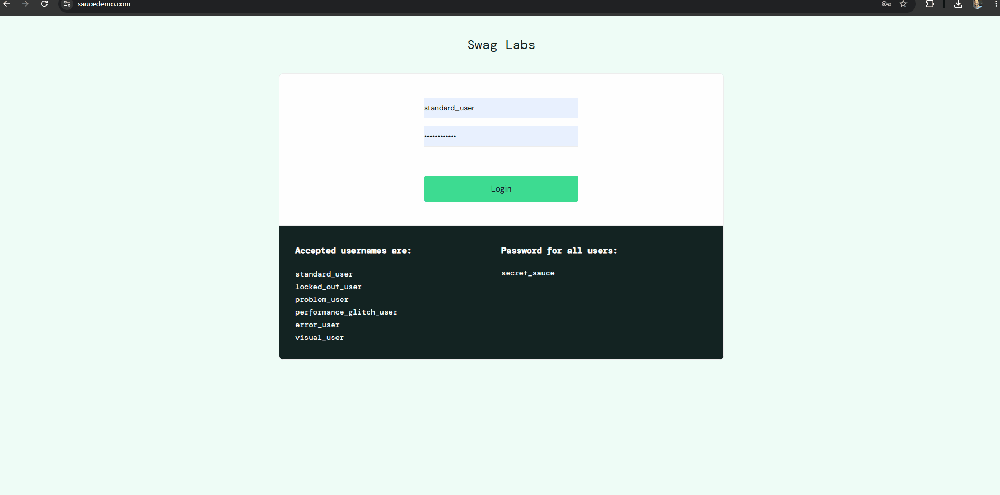

## Status
PASS
